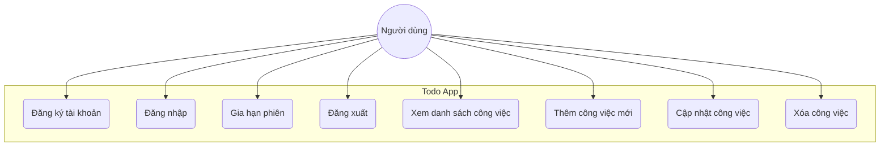
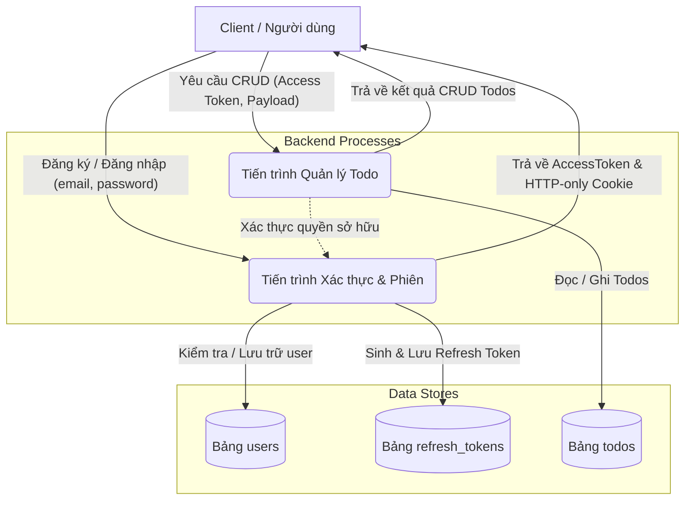
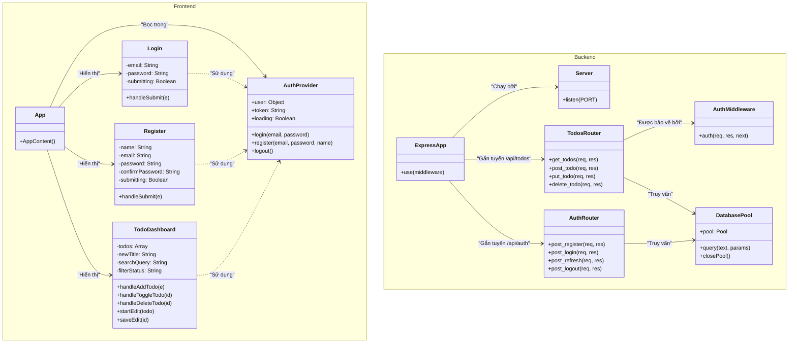
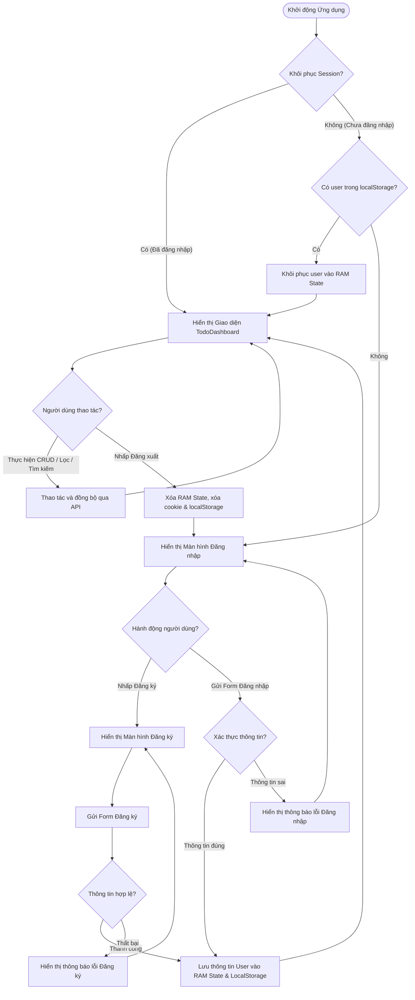
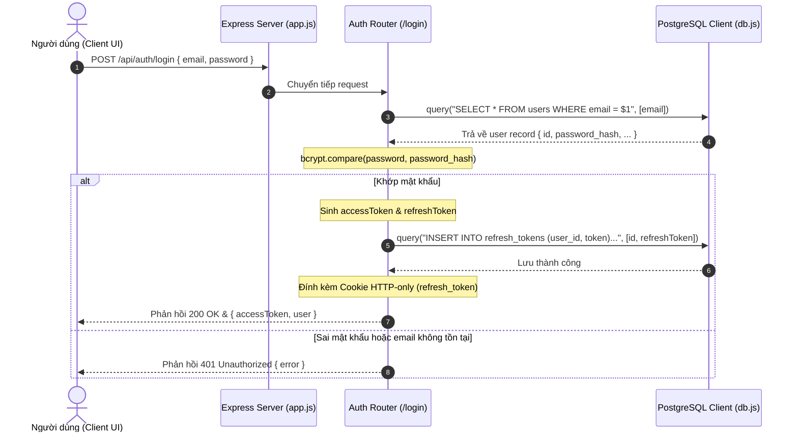
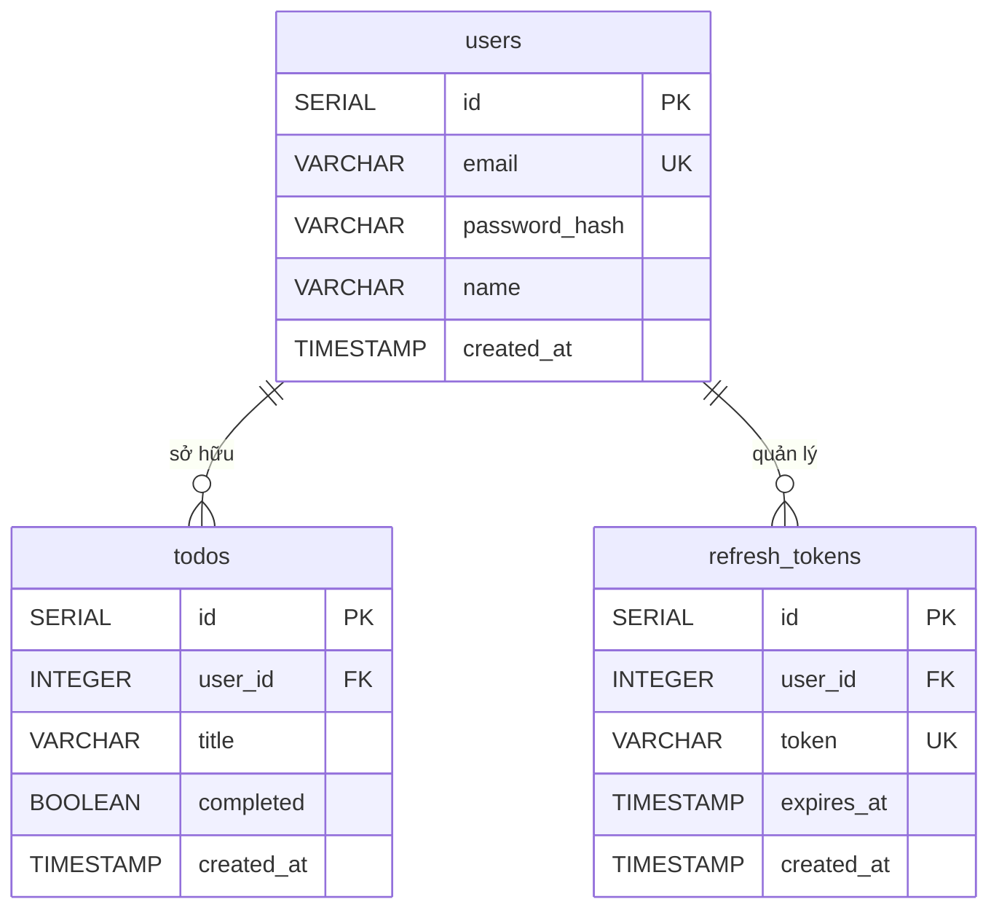

# Ứng Dụng Quản Lý Công Việc - Todo List App

Ứng dụng Todo List cao cấp được thiết kế và xây dựng theo mô hình phân tách Frontend và Backend độc lập, tích hợp các tiêu chuẩn bảo mật JWT Auth Flow (Access/Refresh Token), phân quyền chống lỗ hổng IDOR, phòng vệ chống DoS, cùng hệ thống giao diện Curated Responsive hỗ trợ ba tông màu (Cream, Dark, Gray).

---

## 1. Giới Thiệu & Tính Năng Nổi Bật

Todo List App cung cấp giải pháp quản lý công việc cá nhân bảo mật và tối ưu trải nghiệm người dùng:
*   **Hệ thống Xác thực Bảo mật cao:** Đăng ký và Đăng nhập bảo mật. Access Token thời gian ngắn lưu trong RAM; Refresh Token thời gian dài lưu trong cơ sở dữ liệu và chuyển giao qua Cookie HTTP-Only (`Secure`, `SameSite=Lax`, `HttpOnly`) nhằm phòng chống tấn công XSS và CSRF.
*   **Cơ chế Tự động Gia hạn (Silent Refresh):** API Client tự động gửi yêu cầu ngầm gia hạn Access Token khi token cũ hết hạn (lỗi `401 Unauthorized`), thực hiện lại tác vụ ban đầu mà không làm gián đoạn trải nghiệm của người dùng.
*   **Quản lý Công việc (CRUD) Toàn diện:** Thêm mới, đánh dấu hoàn thành, cập nhật tiêu đề trực tiếp (inline edit), tìm kiếm theo từ khóa và lọc theo trạng thái công việc (Tất cả, Đang làm, Đã hoàn thành).
*   **Chống Lỗ hổng IDOR:** Kiểm tra chặt chẽ quyền sở hữu trước khi cập nhật hoặc xóa công việc. User không thể đọc hoặc chỉnh sửa công việc của người khác thông qua việc thay đổi ID trên URL/Payload.
*   **Thiết kế Giao diện Curated & Responsive:** Hỗ trợ 3 tông màu chủ đạo đồng bộ, responsive mượt mà trên mọi thiết kế màn hình (Desktop, Tablet, Mobile) và ngăn ngừa lỗi tự động đảo màu của trình duyệt.

---

## 2. Công Nghệ Sử Dụng

### Frontend (ReactJS)
*   **Build Tool & Dev Server:** Vite (React 18+)
*   **Styling:** Vanilla CSS kết hợp CSS Variables (Design Tokens) để quản lý màu sắc và bố cục linh hoạt
*   **State Management:** React Context API (`AuthContext`) quản lý trạng thái đăng nhập toàn cục
*   **API Client:** Native Fetch API với cơ chế tự động đánh chặn và xử lý lỗi Gateway an toàn
*   **Unit/Integration Test:** Vitest & React Testing Library (chạy trong môi trường giả lập `jsdom`)

### Backend (Node.js & Express)
*   **Framework:** Express.js
*   **Database Client:** `pg` (PostgreSQL Client) hỗ trợ Parameterized Queries (truy vấn tham số hóa) phòng tránh SQL Injection
*   **Mã hóa:** `bcryptjs` để băm mật khẩu với độ mạnh 10 rounds
*   **Token Authorization:** `jsonwebtoken` (JWT) cấp phát Access Token (15 phút) và Refresh Token (7 ngày)
*   **Middleware:** Cookie Parser đọc token từ client; CORS kiểm soát origin động
*   **Unit/Integration Test:** Vitest & Supertest mock database layer

### Database & Devops
*   **Database:** PostgreSQL 16 Alpine
*   **Containerization:** Docker & Docker Compose
*   **Hosting Configuration:** Hỗ trợ biến môi trường `VITE_API_BASE_URL` (Frontend) và `FRONTEND_URL` (Backend) phục vụ deploy và cấu hình CORS chéo domain.

---

## 3. Hệ Thống Thiết Kế Giao Diện (Design System)

Ứng dụng sử dụng hệ thống Design Token nhất quán khai báo qua CSS Variables ở đầu tệp `index.css`. Hệ thống hỗ trợ 3 tông màu tùy chọn:

| Tông màu | Biến CSS (.theme-[name]) | Mô tả |
| :--- | :--- | :--- |
| **Cream** | `.theme-cream` | Tông màu nền kem sữa ấm áp, chữ tối màu dịu mắt (Mặc định) |
| **Dark** | `.theme-dark` | Giao diện tối huyền bí, độ tương phản cao, dịu mắt ban đêm |
| **Gray** | `.theme-gray` | Tông màu xám trung tính, hiện đại và tối giản |

### Tokens Màu sắc chủ đạo:
*   `--color-primary`: Màu chủ đạo cho các hành động quan trọng (Đăng nhập, Thêm mới).
*   `--color-background`: Màu nền chính của ứng dụng, thay đổi linh hoạt theo theme.
*   `--color-surface`: Màu nền của các thẻ card, container phụ trợ.
*   `--color-text-primary`: Màu chữ nội dung chính có độ tương phản cao.
*   `--color-text-secondary`: Màu chữ chú thích, gợi ý.

---

## 4. Cấu Trúc Thư Mục Dự Án

Cấu trúc mã nguồn của phiên bản đạt chuẩn:

```text
product/
├── .github/                # Cấu hình GitHub Actions CI/CD
├── .gitignore              # Loại trừ các file build và env
├── README.md               # Tài liệu hướng dẫn này
├── backend/                # Mã nguồn Backend Express
│   ├── src/
│   │   ├── __tests__/      # Unit test cho API & Database
│   │   ├── middleware/     # Auth Middleware (Xác thực JWT Access Token)
│   │   ├── routes/         # Định tuyến Router (auth, todos)
│   │   ├── app.js          # Cấu hình Express, CORS, Cookier Parser & Routes
│   │   ├── db.js           # Module kết nối PostgreSQL Client
│   │   ├── server.js       # Điểm khởi chạy Express Server lắng nghe Port
│   │   └── verify-db.js    # Script kiểm tra kết nối Database cục bộ
│   ├── docker-compose.yml  # File compose khởi tạo container PostgreSQL
│   ├── package.json
│   └── schema.sql          # Lược đồ khởi tạo database & chỉ mục
└── frontend/               # Mã nguồn Frontend React
    ├── src/
    │   ├── __tests__/      # Kiểm thử giao diện & tính năng tích hợp
    │   ├── assets/         # Chứa hình ảnh và Logo ứng dụng (app_icon.png)
    │   ├── components/     # Các Component UI (Login, Register, TodoDashboard)
    │   ├── context/        # AuthContext quản lý session người dùng
    │   ├── services/       # API Client (Đăng nhập, đăng ký, CRUD Todos)
    │   ├── tests/          # Cấu hình môi trường kiểm thử
    │   ├── App.jsx         # Component gốc điều hướng hiển thị
    │   ├── index.css       # CSS Variables Theme & Styling
    │   └── main.jsx        # Điểm gắn kết DOM của React App
    ├── index.html          # File HTML gốc (Favicon liên kết logo)
    ├── package.json
    └── vite.config.js      # Cấu hình Vite & Vitest
```

---

## 5. Sơ Đồ Hệ Thống & Luồng Dữ Liệu

### 5.1 Sơ đồ Use Case (Use Case Diagram)


### 5.2 Sơ đồ Luồng Dữ Liệu (Data Flow Diagram - DFD Cấp 1)


### 5.3 Sơ đồ Lớp Tĩnh (Class Diagram)


### 5.4 Sơ đồ Hoạt Động (Activity Diagram)


### 5.5 Sơ đồ Tuần tự tiêu biểu (Sequence Diagram - UC Đăng nhập)


---

## 6. Sơ Đồ Cơ Sở Dữ Liệu (ERD & Database Schema)

Hệ thống sử dụng cơ sở dữ liệu quan hệ PostgreSQL gồm 3 bảng chính được tối ưu hóa chỉ mục (Indexes) nhằm đẩy nhanh tốc độ truy vấn:



### Chi tiết lược đồ SQL (`schema.sql`):
1.  **Bảng `users`**: Lưu trữ thông tin tài khoản người dùng. Trường `email` được đánh dấu `UNIQUE` để tránh trùng lặp.
2.  **Bảng `todos`**: Lưu trữ danh sách công việc. Trường `user_id` liên kết khóa ngoại (`REFERENCES users(id) ON DELETE CASCADE`). Tạo **chỉ mục `idx_todos_user_id`** trên cột `user_id` để tăng tốc độ truy vấn lọc công việc của từng người dùng.
3.  **Bảng `refresh_tokens`**: Lưu trữ token làm mới phục vụ gia hạn phiên an toàn. Cột `token` được đánh dấu `UNIQUE`. Tạo **chỉ mục `idx_refresh_tokens_token`** giúp tăng tốc độ tìm kiếm và đối chiếu token khi người dùng gửi yêu cầu Silent Refresh.

---

## 7. Hướng Dẫn Cài Đặt & Chạy Cục Bộ (Local Deployment)

### Yêu cầu hệ thống:
*   Đã cài đặt Node.js (phiên bản 18 trở lên)
*   Đã cài đặt Docker & Docker Compose (cho PostgreSQL Database)

### Các bước cài đặt:

1.  **Khởi chạy Database:**
    Di chuyển vào thư mục backend và chạy Docker Compose để khởi chạy cơ sở dữ liệu:
    ```bash
    cd backend
    docker-compose up -d
    ```

2.  **Khởi tạo Cấu hình Môi trường (.env):**
    Tạo tệp `.env` trong thư mục `backend/` theo mẫu `.env.example`:
    ```ini
    PORT=5000
    DB_USER=postgres
    DB_PASSWORD=postgres
    DB_HOST=localhost
    DB_PORT=5432
    DB_DATABASE=todolist
    JWT_SECRET=super-secret-jwt-key
    JWT_REFRESH_SECRET=super-secret-refresh-key
    ```

3.  **Cài đặt Dependencies & Khởi chạy Backend:**
    ```bash
    npm install
    npm start
    ```
    *(Để kiểm tra kết nối database thành công, bạn có thể chạy: `node src/verify-db.js`)*

4.  **Cài đặt & Khởi chạy Frontend:**
    Mở một cửa sổ terminal mới, di chuyển vào thư mục frontend:
    ```bash
    cd ../frontend
    npm install
    npm run dev
    ```
    Truy cập vào ứng dụng tại `http://localhost:5173`.
